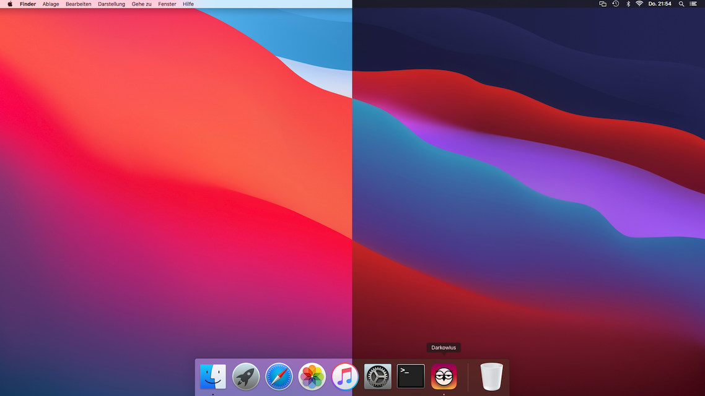

Automatically darkens macOS appearance and desktop picture in the nighttime.
Runs, e.g., on my Mac mini 2010 with macOS High Sierra.

# Getting started

To create an application from `darkowlus.applescript`, open it in Script-Editor,
set your location, and export the modified script as stay-open application. Put
the application into the `darkowlus` folder. Then put arbitrary desktop pictures
`Daytime.jpg` and `Nighttime.jpg` into that folder, too, and run the application
you created.

# Thanks

This software uses [sunrise-sunset.org](https://sunrise-sunset.org) API and
the Night Owl icon from [macOS App icons](https://macosicons.com/).
